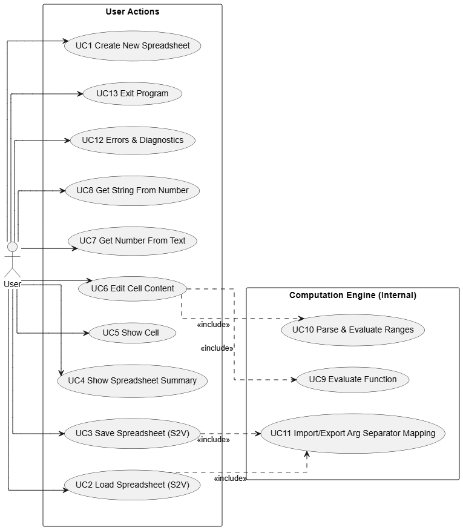
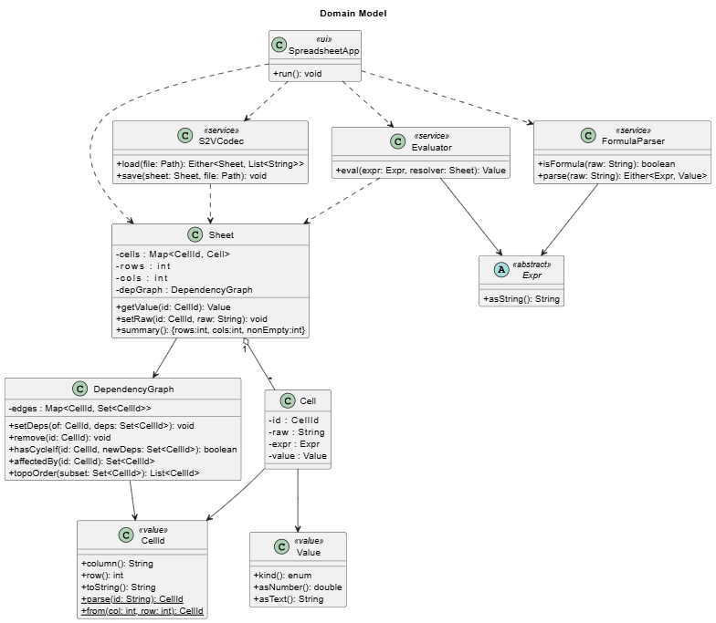

# Spreadsheet Project: Deliverable 1 Report

## Introduction

This deliverable describes the main use cases for the spreadsheet system and the initial domain model. The goal is to define what the system should support at this stage and how the main parts of the design fit together. The project focuses on core spreadsheet behavior: loading, saving, editing, formula evaluation, and consistency management. For this assignment, features such as formatting, multi-sheet support, or a graphical interface are not considered.

---

## 1. Use Cases

Each use case includes an explanation, reasoning, and trigger. Together they describe how the user interacts with the spreadsheet system and what the system must handle.

1. UC1: Create new spreadsheet
   • Explanation: Create an empty spreadsheet with a defined or default size.
   • Reasoning: The program needs an initial grid of cells.
   • Triggers: User selects “new spreadsheet”.

2. UC2: Load spreadsheet (S2V)
   • Explanation: Read an S2V file, parse contents, validate formulas, rebuild dependencies, and recompute values.
   • Reasoning: The program must restore a consistent state from a file.
   • Triggers: User selects “load spreadsheet”.

3. UC3: Save spreadsheet (S2V)
   • Explanation: Write the spreadsheet to an S2V file with the correct separators.
   • Reasoning: Users must be able to store spreadsheet data.
   • Triggers: User selects “save spreadsheet”.

4. UC4: Show spreadsheet summary
   • Explanation: Show the spreadsheet size and the number of non-empty cells.
   • Reasoning: Users may want a quick overview.
   • Triggers: User selects “show summary”.

5. UC5: Show cell
   • Explanation: Display the stored content and computed value of a cell.
   • Reasoning: Users need to inspect formulas and results.
   • Triggers: User requests a specific cell such as A1.

6. UC6: Edit cell content
   • Explanation: Update a cell, parse and validate formulas, check for circular dependencies, update the dependency graph, and recompute affected cells.
   • Reasoning: Editing must keep the spreadsheet in a valid state.
   • Triggers: User selects “edit cell”.

7. UC7: Get number from text
   • Explanation: Convert text to a number. An empty cell results in 0, valid numeric strings result in numbers, and invalid strings produce an error.
   • Reasoning: Text cells must behave predictably in numeric contexts.
   • Triggers: A formula requests a numeric value.

8. UC8: Get string from number
   • Explanation: Convert a numeric cell to a string or return an empty string if the cell is unset.
   • Reasoning: Needed for display and S2V saving.
   • Triggers: A formula or save operation requests a string value.

9. UC9: Evaluate function
   • Explanation: Evaluate SUMA, MIN, MAX, and PROMEDIO with support for numbers, ranges, and nested functions.
   • Reasoning: Functions form part of the calculation model.
   • Triggers: Formula evaluation or dependent-cell recomputation.

10. UC10: Parse and evaluate ranges
    • Explanation: Interpret ranges such as A1:B3 and expand them into cell references.
    • Reasoning: Ranges are used inside functions.
    • Triggers: A formula includes a range.

11. UC11: Import and export separators
    • Explanation: Convert “,” to “;” on load and “;” to “,” on save inside function arguments.
    • Reasoning: Required by the S2V file format.
    • Triggers: File load or save.

12. UC12: Errors and diagnostics
    • Explanation: Show parsing errors, circular dependencies, invalid references, and evaluation issues.
    • Reasoning: Users need clear feedback.
    • Triggers: Load, edit, or evaluation errors.

13. UC13: Exit program
    • Explanation: Close the program and warn about unsaved changes if needed.
    • Reasoning: Avoids accidental data loss.
    • Triggers: User selects “exit”.

---

## 2. Use Case Diagram

Based on these use cases, I created the use case diagram. The diagram places the user on the left, the spreadsheet system in the center, and the included use cases on the right. 

Diagram:


---

## 3. Domain Model

Next we make the domain model. The domain model describes the key parts of the spreadsheet and how they support the use cases.

The central object is the Sheet, which stores all Cell objects and maintains a DependencyGraph. The graph is used to track references between cells and detect cycles early. This avoids situations where formulas refer to each other in ways that cannot be evaluated.

Each Cell stores:

* its raw text input
* a parsed expression when relevant
* a computed value of type Empty, Text, Number, or Error

Storing the parsed expression avoids re-parsing on each evaluation and makes updates more efficient.

Formula handling is divided into two services to keep responsibilities clean and easier to test:

* FormulaParser: Checks whether a string is a formula and produces an expression tree.
* Evaluator: Computes results, manages coercion between text and numbers, handles ranges, and evaluates functions such as SUMA, MIN, MAX, and PROMEDIO. The evaluator queries the sheet for referenced cell values.

The S2VCodec loads and saves spreadsheets in the S2V format. It also handles conversion of argument separators during load and save operations.

At the top level, the SpreadsheetApp coordinates user actions. It connects the interface-level commands to the domain operations. This ties the use cases to the model. For example:

* UC6 (Edit cell) uses the DependencyGraph to update references and the Evaluator to recompute values.
* UC2 (Load spreadsheet) uses the S2VCodec and then triggers value recomputation in the Sheet.
* UC5 (Show cell) retrieves raw and computed values stored in the Cell.


Diagram:



# Deliverable 2 Implementation Notes

This second deliverable focuses on getting the core structure of the spreadsheet working with a minimal, clean design. The goal was to keep things simple while leaving room for later extensions like formula parsing and dependency tracking.

## Overview

I implemented three main domain classes:

### **Cell**

A small object that stores the raw content of a cell as a string. At this point, I’m not evaluating values or distinguishing between numbers, text, or formulas. The cell just holds whatever the user or file provides.

### **CellAddress**

A tiny value object that keeps the row/column position of each cell and provides `equals`/`hashCode` so the map in `Spreadsheet` can index cells consistently.

### **Spreadsheet**

The spreadsheet manages a collection of `Cell` objects. For storage, I chose a `Map<CellAddress, Cell>` so I only keep the cells that have been explicitly assigned and avoid having to maintain large arrays filled mostly with empty entries. This keeps the implementation lightweight and efficient for the current assignment. In the future, this data structure may need to be adapted to support evaluations while keeping performance good, but for now it works well.

The spreadsheet also exposes simple methods to:

- Set the content of a cell
- Get the content of a cell
- Query the current number of rows and columns based on the populated cells

## File I/O

To load and save spreadsheets, I added basic S2V-style operations:

- Load: Read each row, split by `;`, and create cells for every entry present in the file.
- Save: Write out the spreadsheet row by row using the same separator rules.

No parsing or evaluation is done; the data is stored exactly as it appears in the file so that round-tripping works for now.

## Code

The full implementation is here:
**[https://github.com/henryblu/SOFTENG/tree/main/TheSpreadsheet](https://github.com/henryblu/SOFTENG/tree/main/TheSpreadsheet)**

## Directory Structure
So far, the project is organized as follows:
```
TheSpreadsheet/
├── src/
│   └── (Java source files)
├── data/
│   └── (sample S2V input/output files)
└── deliverables.md
```

# Deliverable 3 – Implementation Notes

For Deliverable 3, my goal was to add the first basic slice of formula support. Any cell whose text starts with = should be parsed, evaluated, and shown as a numeric result, while keeping file compatibility with Deliverable 2. I implemented this by adding a formula package and making small adjustments to Cell and Spreadsheet.

## Implementation Summary

* **Evaluation in the cell**
  Each Cell now stores both the raw content and a displayValue. When I call setContent, the cell runs a private evaluate() method. It checks for a leading = and, if present, runs the formula logic. The rest of the spreadsheet code doesn’t change; users now call getCellDisplayValue to show the result.

* **Error handling**
  If tokenizing or evaluating fails, FormulaException is caught inside Cell.evaluate(). In those cases, the cell shows #ERR. This keeps cell state predictable even when the formula is invalid.

* **Formula package structure**
  I added Token, TokenType, FormulaTokenizer, and `FormulaEvaluator` under `src/formula`. These are standalone helpers that will remain useful once I start adding dependency graphs or cross-cell references later.

## FormulaTokenizer

`FormulaTokenizer.tokenize(String)` scans the substring after `=` in a single pass. Each item becomes a `Token` instance that wraps a `TokenType` (enum) plus an optional `double` value. I use three static functions (`Token.number(value)`, `Token.operator(type)`, and `Token.simple(type)`) so callers never construct tokens incorrectly. The tokenizer emits, in order:

* numeric tokens (integers and decimals via `Double.parseDouble`)
* the operators `+`, `-`, `*`, `/`
* parentheses
* an explicit `EOF` token

The tokenizer ignores whitespace. It does not yet support unary operators, identifiers, or cell references. Invalid characters or malformed numbers raise a `FormulaException` with a position reference.

## FormulaEvaluator

`FormulaEvaluator.evaluate(List<Token>)` implements a stack-based evaluator similar to the shunting-yard approach:

1. Numbers go straight onto the value stack.
2. When an operator appears, I call `collapseByPrecedence` to apply any higher- or equal-precedence operators already on the operator stack.
3. Parentheses use `collapseUntilLeftParen` to enforce grouping.
4. After the final token, any remaining operators are applied.

`applyTopOperator` executes the four basic arithmetic operations. It checks for division by zero and missing operands and throws `FormulaException` if something is wrong. `Cell` converts those errors into `#ERR`.

## Current Limitations and Next Steps

Right now, formulas support only numeric literals and the operators `+`, `-`, `*`, and `/`. There’s no unary minus/plus, exponentiation, functions, or cross-cell references. I also output results using `Double.toString`.

Next we will integrate the provided parser and add unit tests.


# Deliverable 4 – Maven + Unit Tests

For Deliverable 4 I reorganized the repo into a Maven-friendly layout and wrote the first round of JUnit coverage. Everything now lives under `src/main/java` and `src/test/java`, wired up through a `pom.xml` so `mvn clean test` builds and runs in one shot.

## Maven project layout

* Added a `pom.xml` with group/artifact metadata, Java 11 compiler settings, JUnit Jupiter 5.10.2, and Surefire 3.2.5 configured to stay off the module path.
* Moved production sources under `src/main/java/spreadsheet/**` and trimmed the old manual build artifacts; `bin/` is now optional instead of required.
* Updated the README with the new workflow, including how to run the CLI through Maven or directly from `target/classes`.

## Initial unit coverage

* `SpreadsheetTest` exercises the basic spreadsheet behaviors: blank cells stay empty, `setCellContent` drives row/column sizing, formulas show their evaluated display value (or `#ERR` on invalid input), and CSV save/load works via JUnit’s `@TempDir`.
* `FormulaTest` focuses on the tokenizer/evaluator pair, checking whitespace handling, decimals, precedence, parentheses, and error cases like division by zero to make sure `FormulaException` still bubbles up cleanly.

Next up I’ll extend the parser with the provided grammar, expand cross-cell references, and grow the test suite alongside each feature slice.


# Deliverable 5 – Shunting-Yard Parser Refactor

Although this is when we should be implementing the provided Shunting Yard Algorithm, because I had already made the basics of one for the previous assignment I decided to just build my own now. So my goal is to replace the old “tokenize + evaluate immediately” helper classes with a small Shunting-Yard–based pipeline that produces a real AST. For now, this supports only numbers and binary operators, but it gives me the structure I need for references, loop detection, and functions later.

## Current State

* `FormulaTokenizer` only handles numbers and operators. It throws on any identifier, so the grammar is limited to basic arithmetic.
* `FormulaEvaluator` handles both precedence and evaluation directly on the token stream. There is no standalone AST or RPN representation that I can reuse for dependency checks or new features.
* The tests currently cover things like `1+2`, `3*5+4`, parentheses, whitespace handling, and error cases. These need to keep passing after the refactor.

## What Changed

1. **FormulaEngine façade**
   I removed direct knowledge of tokens and stacks from `Cell`. All evaluation now goes through `FormulaEngine.evaluate(String)`, which keeps future changes behind a single entry point.

2. **Standalone lexer**
   I moved `FormulaTokenizer`, `Token`, `TokenType`, and `LexerException` under `spreadsheet.formula.lexer`. Tokens can now carry lexeme and position metadata, but the existing constructors still work, so the lexer stays lightweight.

3. **Shunting-Yard parser**
   I added `ShuntingYardParser` to build an AST using operator and operand stacks instead of returning RPN. The logic follows the previous evaluator, but now it lives in the correct layer.

4. **Minimal AST nodes**
   I added `ExpressionNode`, `NumberNode`, and `BinaryOpNode`. This is enough to represent the current formulas and gives me a place to add `ReferenceNode`, `FunctionNode`, and others later.

5. **Evaluator rewrite**
   I rewrote `FormulaEvaluator` to walk the AST. Number nodes return their value, and binary nodes evaluate their children and apply the operator. The error behavior stays the same, but evaluation is now independent of parsing.

6. **Tests and documentation**
   I updated `FormulaTest` to run the full pipeline (tokenize → parse → evaluate). I also added a new flow diagram in `doc/plantuml-diagrams/formula_flow.puml`. The updated package layout is shown below.

## Expected Outcomes

* Existing numeric formulas still work. All current tests pass, and `FormulaEngine` now handles the entire flow.
* Adding references, cycle detection, ranges, or functions becomes incremental. I can extend token types, AST nodes, or evaluator behavior without rewriting the core algorithm.
* Lexer errors can now report positions, and the AST gives me a proper base for future diagnostics and features.

## Flow Overview

This flow is defined in `doc/plantuml-diagrams/formula_flow.puml`:

1. A `Cell` calls `FormulaEngine.evaluate(...)`.
2. The lexer returns tokens or throws `LexerException`.
3. `ShuntingYardParser` produces an `ExpressionNode` tree.
4. `FormulaEvaluator` walks the tree. Reference and function handling will plug into this step later.

## Source Layout

Current package structure:

```
src/main/java/spreadsheet/formula/
├─ FormulaEngine.java
├─ ast/
│  ├─ ExpressionNode.java
│  ├─ NumberNode.java
│  └─ BinaryOpNode.java
├─ eval/
│  └─ FormulaEvaluator.java
├─ lexer/
│  ├─ FormulaTokenizer.java
│  ├─ LexerException.java
│  ├─ Token.java
│  └─ TokenType.java
└─ parser/
   └─ ShuntingYardParser.java
```

This structure keeps lexing, parsing, AST construction, and evaluation cleanly separated, so I can add new features without reshaping the earlier layers.


# Deliverable 6 – Cell References 

I added support for cell references in formulas. These references are now evaluated recursively. At this stage, circular references are still allowed. .

## What Changed

1. **Lexer**
   I extended `FormulaTokenizer` to recognize column-letter + row-digit patterns and emit a dedicated `REFERENCE` token. This lets the parser treat references the same way as other operands.

2. **AST and parser**
   I added `ReferenceNode` and updated `ShuntingYardParser` so it can push reference nodes onto the operand stack wherever a number is allowed. Each node parses its lexeme into 1-based row and column indices (for example, `AA1` becomes column 27, row 1).

3. **Evaluator**
   I introduced `CellLookup` and updated `FormulaEvaluator` so that when it visits a `ReferenceNode`, it calls `lookup.findCell(row, column)`. If no lookup is provided (such as when evaluating a standalone expression), it throws a `FormulaException`, which the UI displays as `#ERR`.

4. **Cell and spreadsheet wiring**
   Each `Cell` now keeps a reference to its parent `Spreadsheet`. It evaluates its display value using
   `FormulaEngine.evaluate(formula, spreadsheet::resolveCellValue)`
   and exposes `evaluateNumericValue()` so references pull either literal numbers or nested formula results.
   `Spreadsheet.resolveCellValue` locates the target cell, throws an error if it is empty or non-numeric, and returns the numeric value, recursing through formulas as needed.

5. **Tests**
   I added regression tests in `SpreadsheetTest` for references to literal values, references to formula cells, and the empty-cell error case.

# Deliverable 7 – Dependency Graph and Refresh Logic

For Deliverable 7, my goal was to make formula evaluation more robust by introducing explicit dependency tracking between cells. This allows the spreadsheet to detect circular references early and to refresh only the cells affected by a change, instead of recomputing everything.

This deliverable focuses on **correctness and efficiency**, while keeping the design small and readable.

---

## Overview

I added a lightweight dependency graph to the `Spreadsheet`. The graph tracks:

* which cells a formula depends on
* which cells depend on a given cell

With this information, the spreadsheet can:

* reject circular references before committing an edit
* re-evaluate only the changed cell and its dependents

This fits naturally with the AST-based formula pipeline introduced in the previous deliverables.

---

## Dependency tracking

The `Spreadsheet` now owns two maps:

* **dependencies**: for each cell, the set of cells it references
* **dependents**: for each cell, the set of cells that reference it

Whenever a cell is edited and the content is a formula, the spreadsheet:

1. parses the formula into an AST
2. walks the AST to collect referenced cells
3. stores those references as the cell’s dependencies

If the formula is invalid, dependency collection safely returns an empty set so that bad input does not corrupt the graph.

---

## Loop detection

Before committing a formula change, the spreadsheet checks whether the new dependencies would introduce a cycle.

The check is done at update time rather than evaluation time. If a cycle is detected, the edit is rejected and a `FormulaException` is thrown. This ensures that:

* circular references never enter the spreadsheet state
* evaluation logic can assume the dependency graph is acyclic

This approach is more predictable than detecting loops during evaluation and avoids partially updated spreadsheets.

---

## Selective refresh

After a successful edit, the spreadsheet refreshes only the affected cells:

* the edited cell is recalculated
* all of its dependents are recalculated by walking the dependency graph

Each dependent is refreshed once, and the traversal always terminates because cycles are prevented earlier. This keeps recalculation efficient and prepares the design for larger spreadsheets and future GUI use.

---

## Design choices

I considered a simpler approach where each evaluation passes a stack of “currently evaluating” cells to detect loops. While simpler, that method:

* detects cycles only during evaluation, not before committing changes
* does not provide a clear way to refresh dependent cells
* does not scale well once ranges are introduced

Using an explicit dependency graph requires slightly more code, but it cleanly supports both loop detection and selective refresh, which are required for the next features.

---

## Preparing for ranges

At this stage, dependencies come only from single-cell references. The design intentionally treats dependencies as sets of cell addresses, so supporting ranges later will only require expanding a range into multiple addresses during dependency collection. The graph logic itself does not need to change.

# Deliverable 8 – Functions and Ranges

This deliverable adds full support for spreadsheet functions and ranges using the existing lexer → Shunting Yard → AST → evaluator pipeline. The implementation intentionally keeps the earlier architecture intact while extending it to handle function calls, argument lists, and range expansion for dependency tracking and evaluation.

---

## Summary of requirements implemented

The spreadsheet now supports:

- SUMA, MIN, MAX, PROMEDIO functions
- One or more arguments separated by ';'
- Arguments can be:
  - numeric literals
  - a single cell reference
  - a range (A1:B3)
  - another function call (nesting allowed)
- Ranges are rectangular and defined by two cell references

The following example is supported:

=1 + A1*((SUMA(A2:B5;PROMEDIO(B6:D8);C1;27)/4)+(D6-D8))

---

## Design decisions and rationale

### 1) Ranges are only valid inside functions

Decision:
- A range token (A1:B3) is only legal inside a function argument list.

Reasoning:
- The requirements define ranges as function arguments only.
- This avoids ambiguous behavior like "A1:B3 + 1" and keeps the evaluator simple.

Implementation detail:
- The parser allows ':' only when inside a function argument context, otherwise it throws a FormulaException.

---

### 2) Integrate functions and ranges into the existing Shunting Yard parser (Option A)

Decision:
- We extended the existing Shunting Yard parser rather than introducing a separate parser.

Reasoning:
- This keeps a single, consistent parse pipeline.
- It allows nested functions and arithmetic within arguments without special handling.

Implementation detail:
- The operator stack stores function name tokens (IDENT).
- A function call is built when ')' closes a function argument list.
- Argument counts are tracked with a separate stack, incremented when ';' is encountered.

---

### 3) Lexer supports identifiers, separators, and ranges

Decision:
- The lexer now emits IDENT, SEMICOLON, and COLON tokens.

Reasoning:
- We need identifiers for function names (SUMA, PROMEDIO, etc.).
- ';' and ':' are part of the required function/range syntax.

Implementation detail:
- Letter sequences become IDENT if no digits follow; otherwise they become REFERENCE.

---

### 4) Explicit AST nodes for functions and ranges

Decision:
- Introduce FunctionCallNode and RangeNode (both are ExpressionNode).

Reasoning:
- Functions and ranges are first-class syntax elements and should be represented explicitly.
- This keeps dependency tracking and evaluation clean and testable.

Implementation detail:
- RangeNode stores two ReferenceNode endpoints.
- RangeBounds normalizes the endpoints to top-left / bottom-right (min/max) for iteration.

---

### 5) Range normalization (Excel-style behavior)

Decision:
- Ranges are normalized so the stored bounds are always top-left → bottom-right.

Reasoning:
- Users can write B3:A1 and still get the expected rectangle.
- This matches common spreadsheet behavior and prevents special-case code.

Implementation detail:
- RangeBounds takes both endpoints and calculates min/max row/column.

---

### 6) Empty cells inside ranges are ignored

Decision:
- Empty cells inside ranges are skipped when aggregating values.

Reasoning:
- This avoids biasing PROMEDIO by counting empty cells as 0.
- It still allows ranges over partially filled areas without errors.

Implementation detail:
- CellLookup exposes findCellOptional for range evaluation.
- OptionalDouble.empty means the cell is empty and should be ignored.

---

### 7) Non-numeric cells in ranges are still errors

Decision:
- If a non-numeric cell is referenced (even inside a range), evaluation throws FormulaException.

Reasoning:
- This preserves the existing numeric-only evaluation rule for references.
- It prevents silent coercion of text inside numeric functions.

---

### 8) Functions are case-insensitive and accept Spanish names

Decision:
- The function dispatcher accepts SUMA and PROMEDIO, as well as SUM and AVERAGE.

Reasoning:
- The spec names the functions in Spanish, but we want English code identifiers.
- Supporting both avoids user confusion and keeps the internal API in English.

Implementation detail:
- FunctionType.fromName maps both spellings to the same enum.

---

### 9) Dependency tracking expands ranges into address sets

Decision:
- Ranges are expanded into individual CellAddress entries when collecting dependencies.

Reasoning:
- The dependency graph is already set-based and works well with explicit addresses.
- This ensures that any cell in a range triggers recalculation when edited.

Implementation detail:
- ReferenceCollector visits RangeNode and adds all addresses in the rectangle.

---

## Implementation overview

### Lexer
- Added: IDENT, SEMICOLON, COLON tokens.
- Letters + digits => REFERENCE; letters-only => IDENT.

### Parser
- Function arguments separated by ';'.
- Function nodes are created when ')' closes a function call.
- ':' is treated as the range operator, allowed only within function argument lists.

### Evaluator
- FunctionCallNode collects values from arguments and dispatches to FunctionEvaluator.
- RangeNode expands to all cells in its bounds and uses findCellOptional to skip empty cells.
- If a RangeNode is evaluated directly (outside a function), it throws an error.

### Spreadsheet / Cell integration
- Spreadsheet implements CellLookup.
- findCellOptional returns empty for empty cells, numeric value otherwise.
- Cell uses FormulaEngine.evaluate(formula, spreadsheet) for both display and numeric evaluation.

---

## Tests added

Unit tests were added to cover:
- SUMA with numeric arguments
- MIN and MAX with ranges
- PROMEDIO with mixed arguments (cells, ranges, literals)
- Nested functions inside larger expressions

---

## Known constraints

- Large ranges are expanded into explicit dependency sets, which is acceptable for current assignment sizes but could be optimized later.
- Ranges are only valid inside function arguments by design.

---

## Summary

This deliverable extends the formula system to include functions and ranges without abandoning the existing parser architecture. The lexer, parser, AST, evaluator, and dependency graph were incrementally expanded with explicit nodes and clear rules. The result is a predictable and testable implementation that matches the specification while keeping the codebase clean and consistent.
